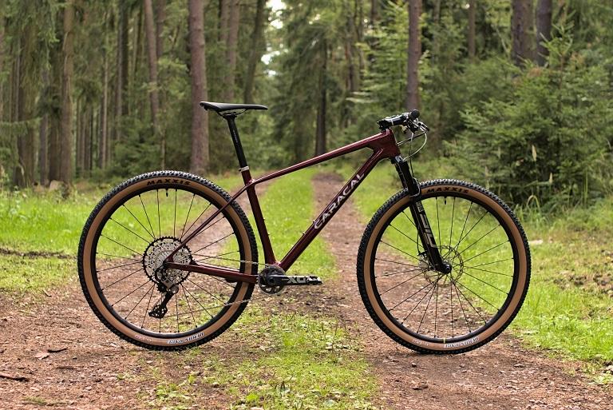

# Beskydské trasy na kole

## **Project overview**
**Objectives:**
This project aims to show bicycle routes where you can explore beauties of Beskydy mountains. It is devided into three categories: 
1. easy
2. medium
3. difficult

Routes are connect to maps with GPS navigation so you can see where you are, how far you are to the end. Easy routes are even for children (the easy one). On each route is description, what you can see along your riding, where you can rest.